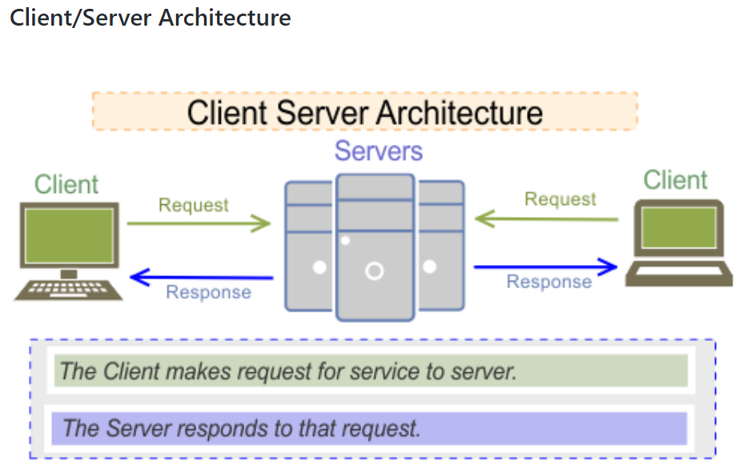

### Additional Serverside Review Lab ###
 
Tasks 1-4 below are meant to give you additional conceptual and syntax review of serverside stuff. This is not a deliverable, but if you want to submit your answers, please put it all in a git repo and slack Alex the link.
  

<ul>
  <li>
<strong>Task 1/4: Intro to fullstack review </strong>  
</li><ul><li>
Consider this picture in the context of someone loading &quot;<a href="http://google.com/">google.com/</a>&quot; on Chrome: 
</li><ol><li>
In this picture, who or what does &quot;client&quot; mean?
</li><li>
What is the server? Is it a program or a machine? In your own words, what is the most important function the server will do?
</li><li>
What does &quot;REQUEST&quot; refer to here? What are the 2 most common types of requests? What does the request line contain? What do the request &quot;headers&quot; contain? What does the request body contain?
</li><li>
What does &quot;RESPONSE&quot; refer to here? What would the response code look like, roughly speaking?
</li></ol><li>
Vocabulary: What are the 7 parts of this diagram?
</li><ul><li>

</li></ul></ul>
  
    

  <li>
<strong>Task 2/4: Node environment review</strong>  
</li><ol><li>
Let's say i have a javascript program that just has a single line that prints something to the console, eg., console.log(&quot;Hello&quot;). How can I run it with nodejs?
</li><li>
Let's say I have a file called exportstuff.js with just the following code:

Also, Let's say I have another file called main.js. There's an error in the import. How can I fix the following main.js file to correctly import the exportstuff.js? Try it in VSCode.

 
</li><li>
In every nodejs project, we have a file called &quot;package.json&quot;, that looks something like this: 
</li><ul><li>
What is the purpose of this file?
</li><li>
Why is the &quot;main&quot;: &quot;server.js&quot; line important?
</li></ul><li>
what is npm? What does it stand for? Why is npm so amazing?
</li><li>
How can we use npm to install packages like &quot;ejs&quot; or &quot;express&quot;? What is the command to install a package and WHERE does it get stored?
</li></ol>
    

  <li>
<strong>Task 3/4: Making your own webserver</strong>  
</li><ol><li>
What does a webserver actually do? On a related note, what do the underlined red lines below mean?
</li><li>
Setup a basic webserver with the following steps:
</li><ol><li>
make a new folder called &quot;test&quot; and open it up with VSCode (or Atom or w/e)
</li><li>
CD into the test folder, use the command line to type &quot;npm init&quot; and hit ENTER like 10 times. This will create a package.json file.
</li><li>
In package.json, replace &quot;main&quot;: &quot;index.js&quot; with &quot;main&quot;: &quot;server.js&quot;
</li><li>
Make a new file inside the &quot;test&quot; folder called server.js with the following code:

</li><li>
In your command line, use npm to install express.
</li><li>
in your command line, type &quot;node server.js&quot; to run your shiny new webserver. (optionally, you can use nodemon to start your server)
</li></ol><li>
Let's say our user must be able to do a GET REQUEST for localhost:3000/pokemon but our webserver is not handling that right now:  😞 😞 😞 

 

 

Fix this problem by adding a new route in your webserver to handle the GET REQUEST for /pokemon. Here's some sample code for a POST request for /cars to help you out:

 

</li></ol>
    

  <li>
<strong>Task 4: EJS and Folder structure</strong>
</li>  <ol><li>
what is the difference between and res.send() and res.render()?
</li><li>
Add the following code to your server.js from above, and use npm to install &quot;ejs&quot;:

</li><li>
Add a new folder called &quot;views&quot; and put a file called &quot;home.ejs&quot; in it, which has nothing but some HTML inside, including a &lt;body&gt; and a &lt;p&gt; tag with some text in it. Now, Add the /home route from task 4 step 1. Does it render in the browser? If not, try to debug it so it works.
</li></ol></ul>

